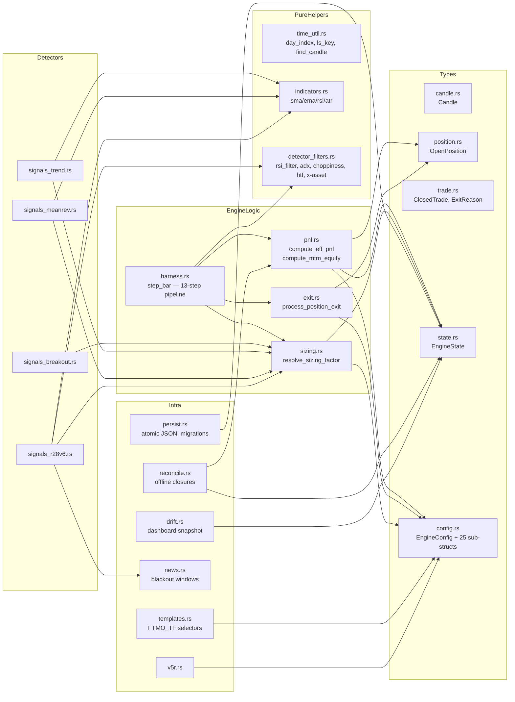
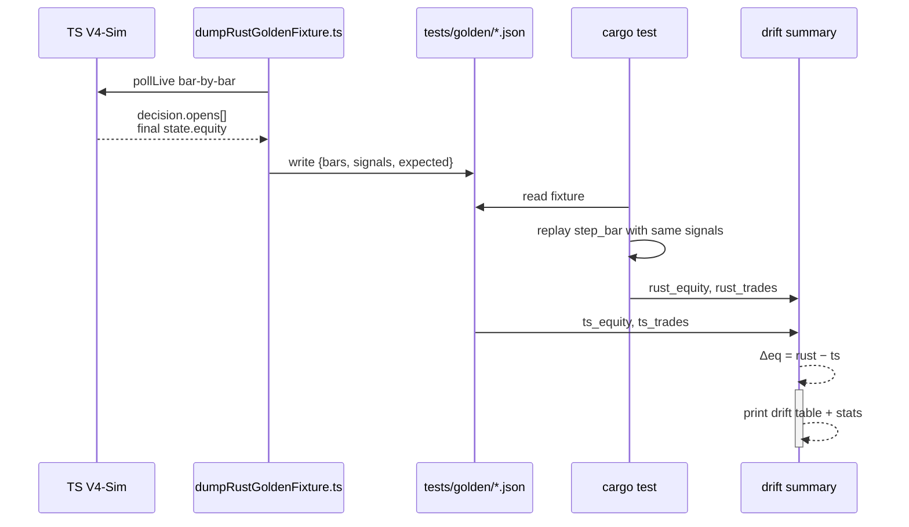

# engine-rust architecture

## Per-bar control flow

```mermaid
flowchart TD
    Start([step_bar called]) --> Stopped{state.stopped_reason?}
    Stopped -->|Some| ReturnStopped[return result with fail]
    Stopped -->|None| FindBar[find oldest common last_bar across feeds]
    FindBar --> Anchor{first call<br/>challenge_start_ts == 0?}
    Anchor -->|yes| SetAnchor[set challenge_start_ts<br/>day_peak = max(mtm, 1.0)<br/>challenge_peak = max(mtm, 1.0)]
    Anchor -->|no| Idem[idempotent guard:<br/>last_bar ≤ state.last_bar?]
    SetAnchor --> Idem
    Idem -->|yes & bars_seen>0| ReturnIdem[return no-op]
    Idem -->|no| Roll[day_index → new_day]
    Roll -->|new_day > cur_day| RolloverY[day_start = equity<br/>day_peak = equity]
    Roll -->|else| MaxDays{new_day ≥ max_days?}
    RolloverY --> MaxDays
    MaxDays -->|yes| ForceClose[force-close all positions<br/>at last bar close]
    ForceClose --> EndTime[challenge_ended<br/>passed/time-fail]
    MaxDays -->|no| MTM[compute_mtm_equity<br/>update day_peak / challenge_peak]
    MTM --> Guardian{V5R<br/>dailyEquityGuardian?}
    Guardian -->|drop ≥ trigger| GuardClose[force-close all<br/>realise loss]
    Guardian -->|no| ExitLoop
    GuardClose --> ExitLoop[per-position exit-check<br/>process_position_exit]
    ExitLoop --> ApplyExits[apply_exits:<br/>compound equity<br/>install reentry slot if Stop<br/>+ kelly push if cfg.kelly]
    ApplyExits --> FailCheck{equity ≤ TL or DL floor?}
    FailCheck -->|yes| ReturnFail[challenge_ended<br/>fail_reason]
    FailCheck -->|no| TargetCheck{equity ≥ profit_target?}
    TargetCheck -->|yes| Target[firstTargetHitDay = day<br/>pause_at_target = true]
    Target --> Passlock{R60 close_all<br/>on_target_reached?}
    Passlock -->|yes| ForceCloseAll[force-close every position<br/>at last bar close]
    Passlock -->|no| MinDays
    ForceCloseAll --> MinDays{trading_days ≥ min_trading_days?}
    MinDays -->|yes| Pass[challenge_ended<br/>passed=true]
    MinDays -->|no| Gates
    TargetCheck -->|no| Gates[Bar-level entry gates:<br/>dailyPeakTrail<br/>challengePeakTrail<br/>idl-throttle<br/>hour-gate / dow-gate]
    Gates -->|entries_allowed=false| Skip[push skips for offered signals]
    Gates -->|allowed| PerSig[per-signal gates:<br/>activate_after_day<br/>min/max_equity_gain<br/>cross_asset_filter<br/>reentry slot? bypass cooldown<br/>lossStreakCooldown<br/>correlationFilter<br/>maxConcurrentTrades]
    Skip --> Bookkeep
    PerSig --> Open[open new positions<br/>scale risk if reentry slot]
    Open --> Bookkeep[bars_seen += 1<br/>last_bar_open_time = last_bar<br/>trim_inline]
    Bookkeep --> ReturnOK([return result])

    style Start fill:#9f9
    style ReturnOK fill:#9f9
    style ReturnStopped fill:#f99
    style ReturnFail fill:#f99
    style ReturnIdem fill:#fcf
    style EndTime fill:#fc9
    style Pass fill:#9f9
    style ForceClose fill:#fcc
    style GuardClose fill:#fcc
    style ForceCloseAll fill:#fcc
```

## State lifecycle

```mermaid
stateDiagram-v2
    [*] --> Initial: EngineState::initial
    Initial --> FirstBar: step_bar (anchor branch)
    FirstBar --> Active: anchored
    Active --> Active: bar advance / position open / close
    Active --> Paused: target hit + pauseAtTargetReached
    Paused --> Paused: ping-trade days
    Paused --> Passed: trading_days ≥ min_trading_days
    Active --> Failed: equity ≤ TL or DL
    Active --> TimedOut: day ≥ max_days, target not hit
    Failed --> [*]
    Passed --> [*]
    TimedOut --> [*]
```

## Module dependency graph



## Numerical-parity verification flow


